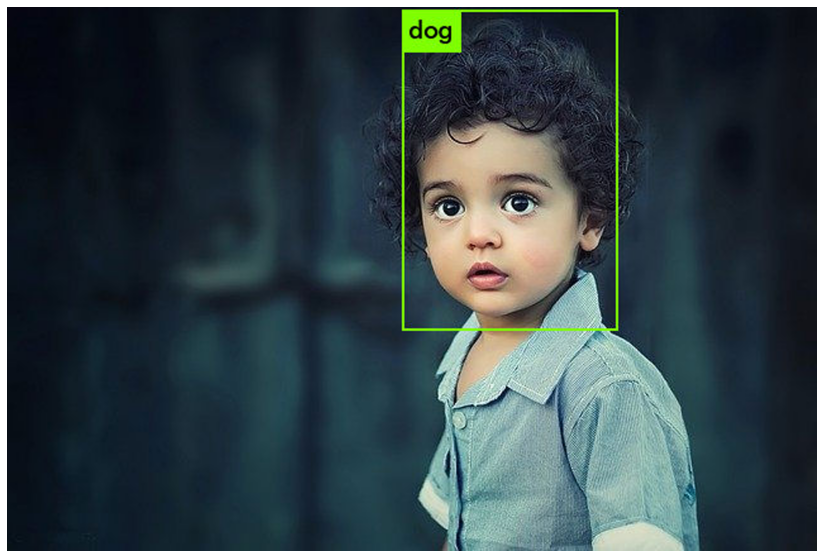

# animal_face_find
# 개요
사람 사진을 입력해서 어떤 동물상인지 찾기
# 사용방법
- Colab에서 yolo_v4_test_train_Roboflow_ok.ipynb 파일 실행
# Data
## 원본 이미지
- 40개
## Anotation box
- 41개
## Train 시간
- 5시간 소요
## 레이블 갯수
- 2개 (원래 고양이, 개, 말, 사슴을 하려 했으나 Train 시간이 17시간 이상 걸려서 레이블 갯수 줄임)
## 결과

